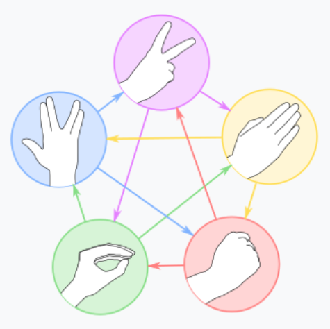

# Intelligent Interactive Systems Project

## What's this

We aim to create an intelligent interactive system that can take a video input,
find the locations of a number of landmarks of a hand in the video, use these landmarks
to recognize the gesture made by the hand, and allow an virtual agent to respond to the
gesture made. In our case decided to allow the user to play a game of 'Rock, Paper,
Scissors, Lizard, Spock with agent'. The agent randomly picks a sign and compares it to
gesture detected and responds to the results of the game. In addition to this we aim to
implement an end-to-end learning version of this system, where we combine the landmark
extraction and gesture recognition modules system into sub-system. We then intend to
compare the performance of these two systems.

    

## TODO

### Foundational part.
- [ ] A landmark detection system
- [ ] A machine learning based gesture recognition system
- [ ] A Kotlin program to control [Furhat](https://furhatrobotics.com/) Robot
- [ ] An API for communication between the Kotlin program and Python Backend

### Specialization part.
- [ ] An end-to-end system (CNN) 

**Note** We may update above todo list

## Reference
- [The Supervised Machine Learning book(An upcoming textbook)](http://smlbook.org/)
- [simpleflow](https://github.com/PytLab/simpleflow)
